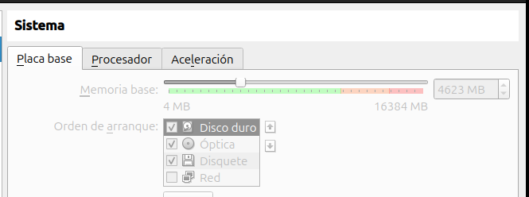
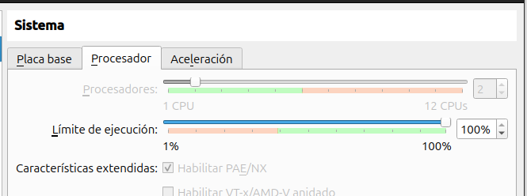
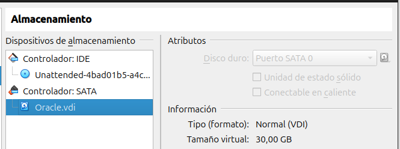
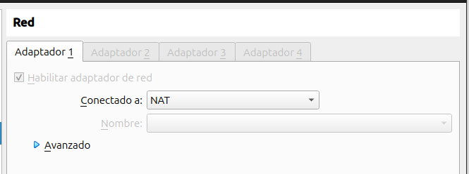
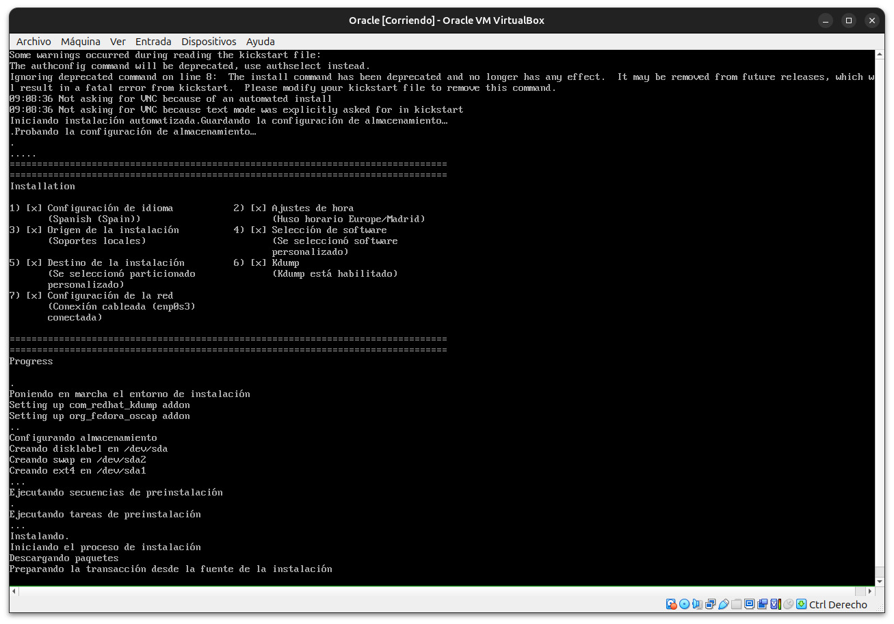
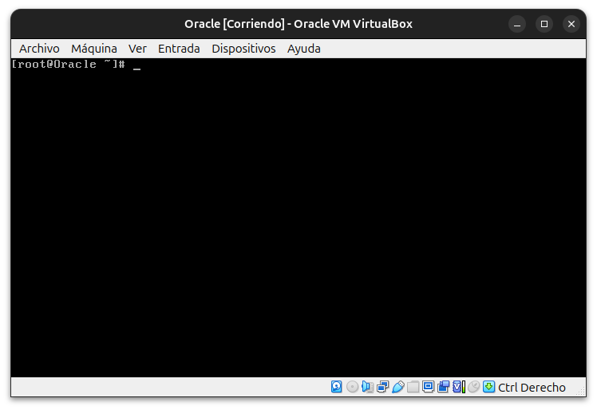

# Instalación de OS Oracle Linux 8.9 (Virtual Box) y Base de datos Oracle en Español

Instalación de maquina virtual en **Virtual Box** mas base de datos para estudiantes.

## Instalación del sistema Operativo

### **Paso 1**: Descarga de la imagen de instalación

Primero deberemos adquirir la Iso necesaria para la instalacion del sistema operativo. Para esto accederemos a **[este link](https://yum.oracle.com/ISOS/OracleLinux/OL8/u9/x86_64/OracleLinux-R8-U9-x86_64-dvd.iso)**. 

En esta **[otra dirección](https://yum.oracle.com/oracle-linux-isos.html)** podremos ver también otras versiones del software.

### **Paso 2**: Configuración de la maquina virtual en **Virtual Box**

Preparamos la maquina virtual con las siguientes especificaciones (Pueden ser alteradas según la necesidad del administrador, estos son valores aproximados).

### **Paso 3**: Iniciamos la maquina desde el disco

Si hemos realizado los pasos correctamente el proceso de instalación del SO deberá realizarse automáticamente, puede tardar unos minutos.

Una vez termine, la maquina se reiniciara y podremos acceder como root con la contraseña especificada al preparar la maquina en **Virtual Box**.

## Instalación de la base de datos Oracle
